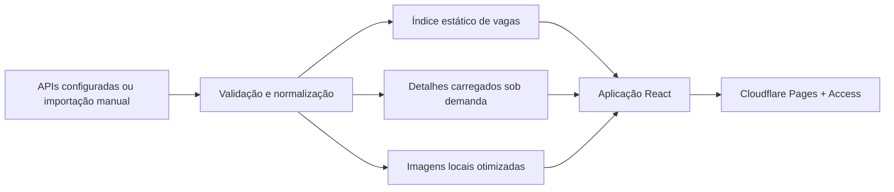

# Vagas Remotas BR

[](https://react.dev/)
[](https://vite.dev/)
[](https://nodejs.org/)
[](https://pages.cloudflare.com/)
[](LICENSE)
[](SECURITY.md)

Painel open source para acompanhar vagas remotas e híbridas disponíveis para profissionais no Brasil. Foi projetado para uso pessoal ou por grupos pequenos, com interface rápida, preferências locais e publicação de baixo custo no Cloudflare Pages.

> **Status:** código e automação preparados. A publicação do catálogo real deve ocorrer somente depois da configuração e validação do controle de acesso.

## Índice

- [Visão geral](#visão-geral)
- [Funcionalidades](#funcionalidades)
- [Início rápido](#início-rápido)
- [Comandos](#comandos)
- [Arquitetura](#arquitetura)
- [Dados e privacidade](#dados-e-privacidade)
- [Publicação no Cloudflare Pages](#publicação-no-cloudflare-pages)
- [Proteção e controle de acesso](#proteção-e-controle-de-acesso)
- [Documentação](#documentação)
- [Histórico de alterações](#histórico-de-alterações)
- [Como contribuir](#como-contribuir)
- [Licença](#licença)

## Visão geral

| Item | Implementação |
| --- | --- |
| Interface | React 19 + Vite 8 |
| Hospedagem | Cloudflare Pages |
| Atualização | GitHub Actions, até três vezes ao dia |
| Persistência pessoal | `localStorage` do navegador |
| Backend da interface | Não necessário |
| Catálogo | Arquivos estáticos validados e divididos em blocos |
| Acesso recomendado | Cloudflare Access com OTP e e-mails aprovados |

O repositório público contém código, documentação e fixtures demonstrativas. Catálogo real, detalhes gerados e imagens processadas permanecem fora do histórico Git.

## Funcionalidades

- busca textual e filtros por área, plataforma e modalidade;
- alternância entre vagas remotas e híbridas;
- ordenação por relevância, data e empresa;
- indicação de há quantos dias a vaga foi publicada;
- detalhes completos exibidos sem sair da aplicação;
- candidatura aberta diretamente na plataforma original;
- vagas visualizadas, favoritas e ocultas identificadas no navegador;
- paginação de 30 vagas e detalhes carregados somente quando necessários;
- logos processados e servidos localmente, sem requisições externas no navegador;
- descarte automático de imagens que não pertencem mais ao catálogo;
- cabeçalhos de segurança, CSP restritiva e proteção contra indexação abusiva;
- pipeline automatizado de coleta, validação, testes, build e publicação.

## Início rápido

Requisitos:

- Node.js 22 ou superior;
- npm compatível com o arquivo `package-lock.json`.

```bash
git clone https://github.com/oliveirasdiogo/vagas-remotas-br.git
cd vagas-remotas-br
npm ci
npm run collect:fixtures
npm run dev
```

O comando de fixtures cria apenas dados demonstrativos seguros para desenvolvimento. A aplicação estará disponível no endereço informado pelo Vite.

## Comandos

| Comando | Finalidade |
| --- | --- |
| `npm run dev` | Inicia o ambiente local |
| `npm run collect:fixtures` | Gera o catálogo demonstrativo |
| `npm run collect` | Executa os conectores configurados pelo mantenedor |
| `npm run validate:catalog` | Impede a publicação de um catálogo vazio, antigo ou inconsistente |
| `npm test` | Executa os testes automatizados |
| `npm run check` | Valida o código com ESLint |
| `npm run build` | Gera a versão de produção em `dist` |
| `npm run preview` | Visualiza localmente o build de produção |

Validação recomendada antes de qualquer publicação:

```bash
npm test
npm run check
npm run validate:catalog
npm run build
npm audit --omit=dev
```

## Arquitetura



O arquivo inicial contém somente os campos necessários para pesquisa, filtros e cards. Descrições, requisitos e benefícios são divididos em blocos estáticos carregados ao abrir uma vaga. Isso reduz transferência, memória e renderização sem exigir banco de dados ou serviço pago.

O GitHub Actions cria o catálogo em um ambiente temporário, executa as validações e envia `dist` diretamente ao Cloudflare Pages. Os arquivos gerados não são enviados de volta ao GitHub.

## Dados e privacidade

- Visualizadas, favoritas e ocultas ficam somente no `localStorage` do domínio.
- O frontend não possui tokens, cookies de integração ou credenciais.
- URLs externas exigem HTTPS e não podem conter usuário ou senha.
- Conteúdo textual é renderizado pelo React sem `dangerouslySetInnerHTML`.
- Logos aceitos são limitados a PNG, JPEG ou WebP e a 300 KB.
- `.env`, catálogo, detalhes, logos e `dist` são ignorados pelo Git.

As vagas podem ser fornecidas por APIs configuradas pelo mantenedor ou por importação manual, sempre respeitando autorizações, termos aplicáveis e as validações do projeto.

## Publicação no Cloudflare Pages

Configuração de build:

| Campo | Valor |
| --- | --- |
| Comando | `npm run build` |
| Diretório de saída | `dist` |
| Node.js | `22` |

O deploy automático utiliza:

- secret `CLOUDFLARE_ACCOUNT_ID`;
- secret `CLOUDFLARE_API_TOKEN`, limitado a **Cloudflare Pages: Edit**;
- variável `CLOUDFLARE_PAGES_PROJECT`.

Nunca coloque esses valores no código, em commits, issues ou logs. Antes do catálogo real, publique somente as fixtures, proteja todos os endereços com Access e execute os testes descritos no guia de [publicação segura](docs/PUBLICACAO-SEGURA.md).

## Proteção e controle de acesso

O projeto inclui CSP restritiva, `robots.txt`, `X-Robots-Tag`, política de mesma origem e detalhes divididos em blocos. No Cloudflare, recomenda-se complementar com:

1. Cloudflare Access com OTP e endereços aprovados individualmente;
2. proteção do domínio personalizado, `pages.dev` e previews;
3. Bot Fight Mode e AI Crawl Control;
4. Managed `robots.txt`;
5. rate limiting calibrado para `/data/*`;
6. revisão periódica dos logs de autenticação e tráfego.

Não configure `Include: Everyone`, permissão baseada somente no método OTP nem regras `Bypass` para os arquivos do catálogo. Conteúdo público não pode ser tornado incopiável; para uso pessoal, a autenticação no edge é a principal barreira contra acesso e coleta não autorizados.

## Documentação

| Documento | Conteúdo |
| --- | --- |
| [Índice da documentação](docs/README.md) | Mapa dos guias e ordem recomendada |
| [Publicação segura](docs/PUBLICACAO-SEGURA.md) | GitHub, primeiro deploy, Access e automação |
| [Proteção contra coleta](docs/PROTECAO-CONTRA-COLETA.md) | Bots, rate limiting, Access e validação |
| [Política de segurança](SECURITY.md) | Controles, limites e relato responsável |
| [Como contribuir](CONTRIBUTING.md) | Requisitos para contribuições |

## Histórico de alterações

Consulte o [histórico de alterações](CHANGELOG.md) para acompanhar as funcionalidades, correções e melhorias publicadas.

## Como contribuir

Contribuições são bem-vindas. Antes de abrir um pull request, leia [CONTRIBUTING.md](CONTRIBUTING.md), não inclua dados reais ou credenciais e execute os testes do projeto.

Vulnerabilidades não devem ser publicadas em issues. Use um [Security Advisory privado](https://github.com/oliveirasdiogo/vagas-remotas-br/security/advisories/new).

## Licença

Distribuído sob a [licença MIT](LICENSE).
